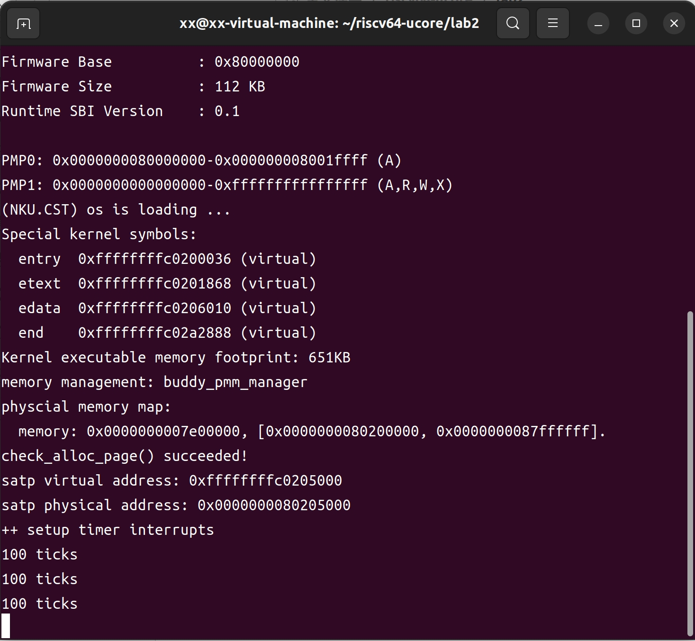

# buddy system分配算法设计文档

## 设计思路

`buddy system`算法是一种目前广泛使用的内存分配算法，它把系统中的可用存储空间划分为存储块来进行管理, 每个存储块的大小必须是2的n次幂`(Pow(2, n))`, 即`1, 2, 4, 8, 16, 32, 64, 128...`

参考[伙伴分配器的一个极简实现](http://coolshell.cn/articles/10427.html)，该实现方式使用了一个完全二叉树来管理内存块的分配。


本文参考该文章的思路，创建一个新的`pmm_manager`，即`buddy_pmm_manager`，将其在文件`buddy_pmm.h`和`buddy_pmm.c`中实现。文件中新建一个结构体用于存放数组形式的完全二叉树和相关属性，在`ucore`中实现`buddy system`分配算法。

## 实现方法

### buddy结构体

定义`buddy`结构体如下，该结构体存放了一个数组形式的完全二叉树，每个节点有两个属性，分别为`longest`：该节点管理的内存块中的最大空闲块数，和`start_page_index`：该节点管理的内存块的起始页号，用于建立二叉树结点和页之间的联系，此外，结构体还定义了该完全二叉树管理的内存页总数和节点数。

```c
struct buddy {
    size_t size; //sum pages
    size_t nodenum; //node nums
    size_t longest[40000]; //complete_binary_tree index and their pagenumbers
    size_t start_page_index[40000]; //first page index that belong to this node
};

struct buddy buddy_tree; //use a complete binary tree to manage pages
```

### 全局变量

**free_list**：与前两种算法不同，该算法使用上述结构体管理内存，而不是`free_list`，所以实际上虽然为了统一性在文件中定义了`free_list`，但是后续的代码不需要用到它。

**buddy_tree：**上述结构体的实例化，用此管理内存块。

**起始页标记：**定义了全局变量`pages_start`用于定位所有页的开始。

```c
struct Page* pages_start; //allocate first page
```

**宏和函数：**定义了一些宏和函数用于快速实现一些功能：

- 快速定位左右子节点和父节点序号
- 判断某数是不是二次幂
- 计算与某数最接近的二次幂（向上取和向下取）
- 返回两数的较大者
- 打印完全二叉树信息

### buddy_init_memmap：初始化

该函数用于初始化页块和`buddy_tree`，与前两种算法不同，首先要将`n`向下取最接近的二次幂值，因为`buddy system`算法管理的存储块大小必须要是二次幂值。这里计算可知最终分配到的页数为`16384`，即`2^14`。

完成页块的初始化后，对`buddy_tree`和`pages_start`进行初始化。

```c
    pages_start = base;
    //init buddy tree
    buddy_tree.size=page_num;
    size_t node_num = 2*page_num-1;
    buddy_tree.nodenum=node_num;
    buddy_tree.longest[0]=page_num;
    buddy_tree.start_page_index[0]=0;
    for(int i=1;i<node_num;i++)
    {
        buddy_tree.longest[i] = buddy_tree.longest[PARENT(i)] / 2;
        if(i%2!=0)
        {
            buddy_tree.start_page_index[i] = buddy_tree.start_page_index[PARENT(i)];
        }
        else
        {
            buddy_tree.start_page_index[i] = buddy_tree.start_page_index[PARENT(i)] + buddy_tree.longest[i];
        }
    }
```

### buddy_alloc_pages：页块分配

该函数用于页块分配。判断完`n`是否大于零后，将其向上取最接近的二次幂：` size_t alloc_size = CLOSEST_POWER_OF_2_ABOVE(n);`，这是实际分配的块大小。调用先前定义的函数`size_t index = find_alloc_index(alloc_size);`返回目标节点序号，目标节点的查找过程和参考文章类似。

```c
static size_t find_alloc_index(size_t n) //find a node whose size==n
{
    if(buddy_tree.longest[0] < n) // too large
    {
        return -1;
    }
    int index=0;
    size_t curr_size;
    //DFS find index
    for(curr_size=buddy_tree.size;curr_size!=n;curr_size /= 2)
    {
        if(buddy_tree.longest[LEFT_CHILD(index)] >= n)
        {
            //struct Page* pl = pages_start + buddy_tree.start_page_index[LEFT_CHILD(index)];
            index = LEFT_CHILD(index);
        }
        else
        {
            index = RIGHT_CHILD(index);
        }
    }
    //update longest array
    buddy_tree.longest[index]=0;
    int i=index;
    while(i)
    {
        i=PARENT(i);
        buddy_tree.longest[i]=MAX(buddy_tree.longest[LEFT_CHILD(i)],buddy_tree.longest[RIGHT_CHILD(i)]);
    }
    return index;
}
```

首先判断当前是否有足够的内存，然后使用深度优先搜索的方式查找到合适的节点，该节点管理的部分目前全部空闲，且管理的内存大小正好等于传入值，因此它管理的内存块可以被分配。取到对应的节点后，向上遍历，更新父节点的`longest`属性。最后返回。

获得节点编号后，根据该节点的`start_page_index`属性将其转化为页号，更新该页的相关属性，然后返回。

```c
    if(index==-1)
    {
        return NULL;
    }
    struct Page *p = pages_start + buddy_tree.start_page_index[index] ;
    p->property = alloc_size;
    ClearPageProperty(p);
    nr_free -= alloc_size;
    return p;
```

### buddy_free_pages：释放页块

该函数用于释放对应的页块，由于页块是整块分配和释放的，因此传入函数的`base`应该是之前分配过的`page`，首先还是对`n`向上取二次幂并更新页块相关属性。然后根据页块头的位置和`n`的位置即可定位`buddy_tree`中唯一对应的节点。

```c
    size_t curr_size;
    size_t index = 0;
    size_t page_i = base - pages_start;
    curr_size=buddy_tree.size;
    while(1)
    {
        if(curr_size < alloc_size)
        {
            return;
        }
        if((curr_size == alloc_size) && (buddy_tree.start_page_index[index]==page_i))
        {
            break;
        }
        else
        {
            if(buddy_tree.start_page_index[RIGHT_CHILD(index)] > page_i)
            {
                index = LEFT_CHILD(index);
                curr_size /= 2;
            }
            else
            {
                index = RIGHT_CHILD(index);
                curr_size /= 2;
            }
        }
    }
```

这里还是使用深度优先算法查找目标节点的序号，如果当前节点的右子节点对应的页序号大于`base`，则向左查找，否则向右查找，理论上只要输入合法，就可以找到。

找到对应节点后，将其`longest`属性的值还原，然后向上遍历父节点，更新`longest`属性。

```c
    buddy_tree.longest[index]=alloc_size;
    size_t left_longest,right_longest;
    while(index)
    {
        index=PARENT(index);
        alloc_size*=2;
        left_longest = buddy_tree.longest[LEFT_CHILD(index)];
        right_longest = buddy_tree.longest[RIGHT_CHILD(index)];
        if(left_longest+right_longest==alloc_size)
        {
            buddy_tree.longest[index]=alloc_size;
        }
        else
        {
            buddy_tree.longest[index]=MAX(left_longest,right_longest);
        }
    }
```

## 测试程序

### 测试样例设计

在函数`buddy_check`中测试上述程序的正确性。

```c
static void 
buddy_check(void)
{
    assert(alloc_pages(20000)==NULL);
    struct Page* p0;
    // 分配p0并检查分配的块是否正确
    p0 = alloc_pages(2000);
    assert(p0!=NULL && p0->property==2048);
    assert(buddy_tree.longest[7]==0 && buddy_tree.start_page_index[7] == p0 - pages_start);
    // 检查父节点是否更新
    assert(buddy_tree.longest[3]==2048 && buddy_tree.longest[1]==4096 && buddy_tree.longest[0]==8192);
    // 依次分配p1,p2,p3,p4
    struct Page* p1 = alloc_pages(8000);
    assert(p1 != NULL && p1->property == 8192);
    assert(buddy_tree.longest[2]==0 && buddy_tree.start_page_index[2] == p1-pages_start);
    assert(buddy_tree.longest[0]==4096);

    struct Page* p2 = alloc_pages(4000);
    assert(p2 != NULL && p2->property == 4096);
    assert(buddy_tree.longest[4]==0 && p2 - pages_start == 4096);
    assert(buddy_tree.longest[1]==2048 && buddy_tree.longest[0]==2048);

    struct Page* p3 = alloc_pages(4000);
    assert(p3==NULL);

    struct Page* p4 = alloc_pages(2000);
    assert(p4!=NULL && p4->property==2048);
    assert(buddy_tree.longest[8]==0 && p4 - pages_start == 2048);
    assert(buddy_tree.longest[3]==0 && buddy_tree.longest[1]==0 && buddy_tree.longest[0]==0);
    //此时内存状态：
    //| p0 | p4 |    p2     |           p1             |
    //|2048|2048|   4096    |          8192            |

    //释放p0,p4，前两块合并
    free_pages(p0,2000);
    free_pages(p4,2000);
    assert(buddy_tree.longest[7]==2048);
    assert(buddy_tree.longest[3]==4096); //检查是否合并
    assert(buddy_tree.longest[1]==4096 && buddy_tree.longest[0]==4096);
    //此时内存状态：
    //|    空    |    p2     |           p1             |
    //|   4096   |   4096    |          8192            |
    
    //检查释放后能否重新分配p5
    struct Page* p5 = alloc_pages(3000);
    assert(p5 != NULL && p5->property==4096);
    assert(buddy_tree.longest[3]==0 && p5==pages_start);
    assert(buddy_tree.longest[1]==0 && buddy_tree.longest[0]==0);
    //此时内存状态：
    //|    p5    |    p2     |           p1             |
    //|   4096   |   4096    |          8192            |

    // 释放失败
    free_pages(p2+10,4000);
    assert(buddy_tree.longest[4]!=4096);
    // 全部释放
    free_pages(p2,4000);
    free_pages(p1,8000);
    free_pages(p5,3000);
    assert(buddy_tree.longest[0]==buddy_tree.size);

};
```

- **检查总的内存大小**。分配一个大于`2^14`的内存块，会分配失败。

- **测试内存分配部分**。分配`2048`大小的块给`p0`，对应节点为7号，程序检查该节点是否进行了相应调整，以及父节点是否得到更新，同理分别分配和测试了`p1~p4`。

- **测试内存释放部分**。释放了`p0`和`p4`，检查释放完后对应的节点7和8有没有恢复成原先的状态，然后检查内存块是否合并，即它们父节点3的值是否更新。然后将合并后的整块内存分配给`p5`，检查能否分配成功。检查输入不合法的情况是否不会释放成功。最后将内存全部释放，检查当前剩余空间是否等于初始值。

### 测试结果

修改`pmm.c`中的函数，将`pmm_manager`改为`buddy_pmm_manager`，这样内核就会使用刚刚编写的`buddy systerm`管理内存了。

```c
static void init_pmm_manager(void) {
    pmm_manager = &buddy_pmm_manager;
    cprintf("memory management: %s\n", pmm_manager->name);
    pmm_manager->init();
}
```

然后在终端运行`make qemu`，内核会调用`buddy_check`函数进行测试，测试结果如下。



显示`check_alloc_page() succeeded!`，说明代码通过了测试程序。

## 不足和改进思路

- 计算得到的初始页数为`32256`，实际管理的页数仅为`16384`，损失了接近一半。改进思路是对于剩余的部分，可以使用其他方式进行管理，或者用多个子`buddy systerm`进行管理，当主系统内存不够时，可以分配给子系统进行管理。
- 根据代码来看，默认返回的都是所有合适块中位于最左边的块，这是否是最合适的选择还有待商榷。