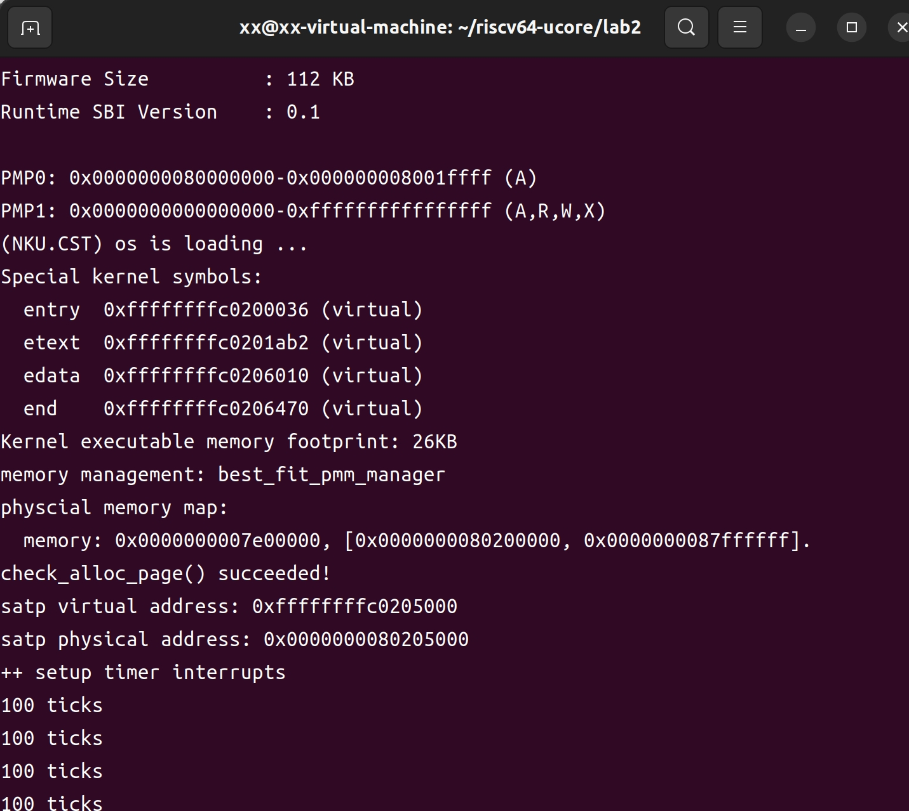
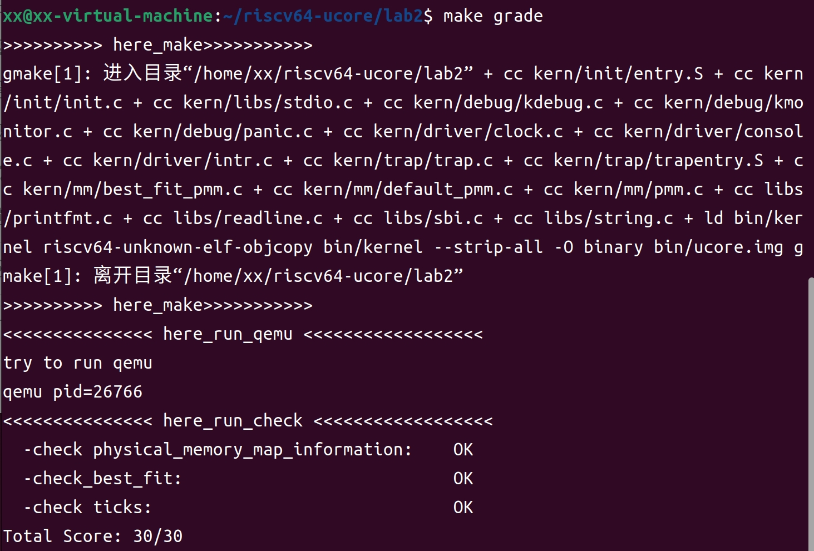

# lab2 实验报告

## 练习1：理解first-fit 连续物理内存分配算法（思考题）

### default_init

- 调用`list.h`中的内联函数初始化`free_list`，将其前向指针和后向指针都指向它自己
- 设置当前空闲块总数为0

### default_init_memmap

**函数作用：**初始化传入的页块`base`，页数为`n`，并根据地址将其链入`free_list`的合适位置。

**函数调用图：**`kern_init --> pmm_init-->page_init-->init_memmap--> pmm_manager->init_memmap`

**执行步骤：**

1. 检查`n`的合法性（是否大于0）

   ```c
   assert(n > 0); //check whether page number>0
   ```

2. 对块内的每一个页进行初始化，设置结构体`Page`内的各个属性

   ```c
   	struct Page *p = base;
       for (; p != base + n; p ++) { //init each page
           assert(PageReserved(p)); // check whether this page is valid
           p->flags = p->property = 0; 
           set_page_ref(p, 0); //page->ref=0; because now p is free and no reference
       }
   ```

3. 单独设置`base`的各项属性并更新空闲块值

   ```c
   	base->property = n;  //base page set totalnum of block
       SetPageProperty(base);  //set base->flags->property bit to 1
       nr_free += n; //update num free blocks
   ```

4. 将该块根据地址将其链入`free_list`的合适位置

   ```c
       if (list_empty(&free_list)) {
           list_add(&free_list, &(base->page_link));
       } else {
           list_entry_t* le = &free_list;
           while ((le = list_next(le)) != &free_list) {
               struct Page* page = le2page(le, page_link);
               if (base < page) {
                   list_add_before(le, &(base->page_link));
                   break;
               } else if (list_next(le) == &free_list) {
                   list_add(le, &(base->page_link));
               }
           }
       }
   ```

   如果`free_list`为空，则将该块作为链表开头，如果找到了合适的位置，则将该块放在链表中间，如果到了链表结尾也没找到，则将其放在链表结尾。

### default_alloc_pages

**函数作用：**遍历`free_list`，找到第一个容量足够的空闲块，将其分配出去，并更新该块剩余部分的大小和`free_list`。

**执行步骤：**

1. 检查输入`n`的合法性，它必须大于0，如果`n`的值大于当前空闲块数，则分配失败。

   ```c
   	assert(n > 0);//check whether block size>0
       if (n > nr_free) { //can't find a free block
           return NULL;
       }
   ```

2. 遍历`free_list`，找到第一个容量足够的空闲块

   ```c
   	struct Page *page = NULL;
       list_entry_t *le = &free_list;
       while ((le = list_next(le)) != &free_list) {
           struct Page *p = le2page(le, page_link);
           if (p->property >= n) { // find the first free block by scanning free_list
               page = p;
               break;
           }
       }
   ```

3. 如果找到了合适的块，如果该块分配`n`的容量后还有剩余，则将剩余部分的开头设为新的块的开头，并更新容量，然后链入`free_list`，最后更新当前空闲块数，将取出的页块设为非空闲状态。

   ```c
   	if (page != NULL) { // really find a free block,update free_list
           list_entry_t* prev = list_prev(&(page->page_link)); //last page
           list_del(&(page->page_link));  // remove this page 
           if (page->property > n) {  //if this page have space remained,update it and insert back
               struct Page *p = page + n; //new page start from block n+1
               p->property = page->property - n; //update property
               SetPageProperty(p); //set new page property to 1
               list_add(prev, &(p->page_link)); //add it to free_list
           }
           nr_free -= n; //re-caluclate nr_free
           ClearPageProperty(page); //page->property ->0
       }
   ```

4. 函数返回该`page`

### default_free_pages

**函数作用：**接收释放的块，将其重新链入`free_list`中去，将其前后相邻的块合并。

**执行步骤：**

1. 检查传入参数的合法性，包括`n`是否为正，块内每个页的属性是否设置正确，并设置每页的属性

   ```c
   	assert(n > 0);
       struct Page *p = base;
       for (; p != base + n; p ++) {
           assert(!PageReserved(p) && !PageProperty(p));//this page have invalid block,error
           p->flags = 0;
           set_page_ref(p, 0);
       }
   ```

2. 单独设置`base`的各项属性

   ```c
   	base->property = n;
       SetPageProperty(base);
       nr_free += n;
   ```

3. 将该块重新链入`free_list`中，连接规则和函数`default_init_memmap`中的一致

   ```c
   	if (list_empty(&free_list)) { //insert this page to free_list
           list_add(&free_list, &(base->page_link));
       } else {
           list_entry_t* le = &free_list;
           while ((le = list_next(le)) != &free_list) {//find a correct position
               struct Page* page = le2page(le, page_link);
               if (base < page) {
                   list_add_before(le, &(base->page_link));
                   break;
               } else if (list_next(le) == &free_list) {//insert to tail
                   list_add(le, &(base->page_link));
               }
           }
       }
   ```

4. 如果该块与`free_list`中的前后项的地址是相连的，则合并

   ```c
   	// try to merge last and next blocks if they are not the beginning of this free_list and connected
       list_entry_t* le = list_prev(&(base->page_link));
       if (le != &free_list) {
           p = le2page(le, page_link);
           if (p + p->property == base) { //their addresses are connected together,merge them
               p->property += base->property;
               ClearPageProperty(base);
               list_del(&(base->page_link));
               base = p; //base = new big page
           }
       }
   
       le = list_next(&(base->page_link));
       if (le != &free_list) {
           p = le2page(le, page_link);
           if (base + base->property == p) {
               base->property += p->property;
               ClearPageProperty(p);
               list_del(&(p->page_link));
           }
       }
   ```

### 算法改进空间

`first fit`算法的优点是实现简单，匹配快速，但是缺点是导致内存空间的碎片化，这会导致可能出现虽然`nr_free`的值大于`n`却无法找到链表中容量大于`n`的内存块，造成内存空间利用率低的现象。可以考虑在分配时在块的大小上加以选择，而不是找到一个就直接分配，例如找到最大容量的块，这样其剩下的空间也会尽可能大一些。

## 练习2：实现 Best-Fit 连续物理内存分配算法

参考kern/mm/default_pmm.c对First Fit算法的实现，编程实现Best Fit页面分配算法。

### 实现过程

`default_init`，`default_init_memmap`，`default_free_pages`三个函数的实现思路均与`first_fit`算法的一致，这里不再赘述。主要是函数`default_alloc_pages`遍历`free_list`查找合适块的部分进行了一些调整，引入了一个新的变量`min_size`用于记录当前遍历的所有块的最小合适容量（大于`n`），用于找到`free_list`所有空闲块中具有最小合适容量的块进行分配。

```c
 	size_t min_size = nr_free + 1;
     /*LAB2 EXERCISE 2: 2110820*/ 
    // 下面的代码是first-fit的部分代码，请修改下面的代码改为best-fit
    // 遍历空闲链表，查找满足需求的空闲页框
    // 如果找到满足需求的页面，记录该页面以及当前找到的最小连续空闲页框数量
    while ((le = list_next(le)) != &free_list) {
        struct Page *p = le2page(le, page_link);
        if (p->property >= n) {
            if(p->property<min_size)
            {
                page = p;
                min_size=p->property;
            }
        }
    }
```

这样内存每次分配时都会分配当前空闲块中最合适的，即容量和要求的容量最接近同时也大于它。

### 测试结果

执行`make qemu`的结果，显示`check_alloc_page() succeeded!`，说明代码能实现目标功能。



执行`make grade`的结果



### 算法改进空间

虽然每次返回的容量都是最合适的，但是每次分配完后剩余的容量非常小，这些小的内存碎片得到利用的概率很低，实际上也是一种浪费。当碎片数量增加时，还会增大搜索时间，所以改进的思路是，当取到合适大小的内存块后，如果计算得到剩余的空间非常小，则干脆不将其分裂，直接全部分配出去，这样即减少了内存碎片，还能减少搜索时间。

## 知识点

本实验主要涉及了OS中内存管理相关的知识点。

- 物理内存和虚拟内存：本次实验将物理内存加上了一个偏移量，从而将物理内存转化为虚拟内存，避免了物理内存挤占的问题
- 页机制：将物理地址映射为虚拟地址之后，我们使用了页表机制分配内存，每一个页表对应了一段物理地址
- 多级页表和快表：当页表项过多时，引入页表的页表，将一块页表项映射到一个大页表项中，块表TLB 是一个高速缓存，用于存储最近的虚拟地址到物理地址的映射，这样取最常用的地址时比较快速，但是本次实验编程的部分主要还是一级页表，没有过多涉及这两部分的内容