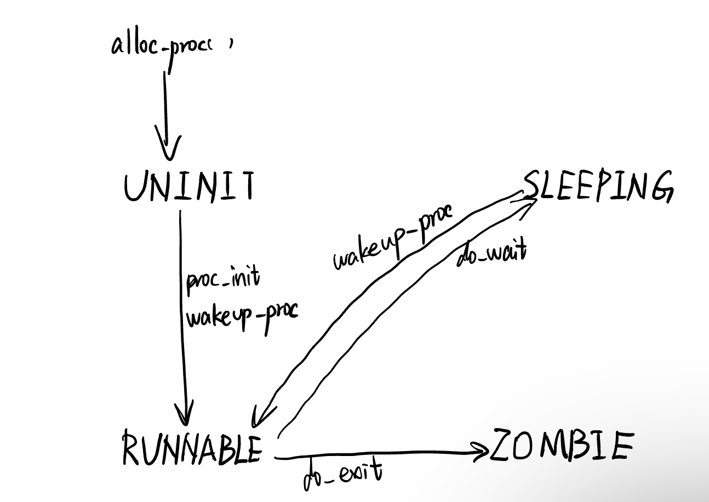

#### 练习0：填写已有实验

本实验依赖实验2/3/4。请把你做的实验2/3/4的代码填入本实验中代码中有“LAB2”/“LAB3”/“LAB4”的注释相应部分。注意：为了能够正确执行lab5的测试应用程序，可能需对已完成的实验2/3/4的代码进行进一步改进。

#### 练习1: 加载应用程序并执行（需要编码）

**do_execv**函数调用`load_icode`（位于kern/process/proc.c中）来加载并解析一个处于内存中的ELF执行文件格式的应用程序。你需要补充`load_icode`的第6步，建立相应的用户内存空间来放置应用程序的代码段、数据段等，且要设置好`proc_struct`结构中的成员变量trapframe中的内容，确保在执行此进程后，能够从应用程序设定的起始执行地址开始执行。需设置正确的trapframe内容。

请在实验报告中简要说明你的设计实现过程。

**设置trapframe：**

```c
/* LAB5:EXERCISE1 YOUR CODE
     * should set tf->gpr.sp, tf->epc, tf->status
     * NOTICE: If we set trapframe correctly, then the user level process can return to USER MODE from kernel. So
     *          tf->gpr.sp should be user stack top (the value of sp)
     *          tf->epc should be entry point of user program (the value of sepc)
     *          tf->status should be appropriate for user program (the value of sstatus)
     *          hint: check meaning of SPP, SPIE in SSTATUS, use them by SSTATUS_SPP, SSTATUS_SPIE(defined in risv.h)
     */
    tf->gpr.sp = USTACKTOP; //用户栈栈顶，在memlayout.h中
    tf->epc = elf->e_entry;
    tf->status=read_csr(sstatus) & ~SSTATUS_SPP & ~SSTATUS_SPIE;
```

- `tf->gpr.sp`设置为用户栈栈顶
- `tf->epc`异常程序计数器设置为用户程序入口点
- `tf->status`需要清除`SSTATUS_SPP, SSTATUS_SPIE`两位
  - SPP记录的是在进入S-Mode之前处理器的特权级别，为0表示陷阱源自用户模式(U-Mode)，为1表示其他模式。当执行一个陷阱时，SPP会由硬件自动根据当前处理器所处的状态自动设置为0或者1。当执行SRET指令从陷阱中返回时，如果SPP位为0，那么处理器将会返回U-Mode，为1则会返回S-Mode，最后无论如何，SPP都被设置为0。
  - SPIE位记录的是在进入S-Mode之前S-Mode中断是否开启。当进入陷阱时，硬件会自动将SIE位放置到SPIE位上，相当于起到了记录原先SIE值的作用，并最后将SIE置为0，表明硬件不希望在处理一个陷阱的同时被其他中断所打扰，也就是从硬件的实现逻辑上来说不支持嵌套中断(即便如此，我们还是可以手动打开SIE位以支持嵌套中断，笑)。当使用SRET指令从S-Mode返回时，SPIE的值会重新放置到SIE位上来恢复原先的值，并且将SPIE的值置为1。


- 请简要描述这个用户态进程被ucore选择占用CPU执行（RUNNING态）到具体执行应用程序第一条指令的整个经过。

1. init_main中调用schedule函数，调度器占用了CPU的资源之后，用户态进程调用了exec系统调用，从而转入到了系统调用的处理例程；
2. 之后进行正常的中断处理例程，然后控制权转移到了syscall.c中的syscall函数，然后根据系统调用号转移给了sys_exec函数，在该函数中调用了do_execve函数来完成指定应用程序的加载；
3. 在do_execve中进行了若干设置，包括推出当前进程的页表，换用内核的PDT，调用load_icode函数完成对整个用户线程内存空间的初始化，包括堆栈的设置以及将ELF可执行文件的加载，之后通过current->tf指针修改了当前系统调用的trapframe，使得最终中断返回的时候能够切换到用户态，并且同时可以正确地将控制权转移到应用程序的入口处；
4. 在完成了do_exec函数之后，进行正常的中断返回的流程，由于中断处理例程的栈上面的eip已经被修改成了应用程序的入口处，而CS上的CPL是用户态，因此iret进行中断返回的时候会将堆栈切换到用户的栈，并且完成特权级的切换，并且跳转到要求的应用程序的入口处；
5. 开始执行应用程序的第一条代码


#### 练习2: 父进程复制自己的内存空间给子进程（需要编码）

创建子进程的函数`do_fork`在执行中将拷贝当前进程（即父进程）的用户内存地址空间中的合法内容到新进程中（子进程），完成内存资源的复制。具体是通过`copy_range`函数（位于kern/mm/pmm.c中）实现的，请补充`copy_range`的实现，确保能够正确执行。

请在实验报告中简要说明你的设计实现过程。

**代码：**

```c
/* LAB5:EXERCISE2 YOUR CODE
             * replicate content of page to npage, build the map of phy addr of
             * nage with the linear addr start
             *
             * Some Useful MACROs and DEFINEs, you can use them in below
             * implementation.
             * MACROs or Functions:
             *    page2kva(struct Page *page): return the kernel vritual addr of
             * memory which page managed (SEE pmm.h)
             *    page_insert: build the map of phy addr of an Page with the
             * linear addr la
             *    memcpy: typical memory copy function
             *
             * (1) find src_kvaddr: the kernel virtual address of page
             * (2) find dst_kvaddr: the kernel virtual address of npage
             * (3) memory copy from src_kvaddr to dst_kvaddr, size is PGSIZE
             * (4) build the map of phy addr of  nage with the linear addr start
             */
            memcpy(page2kva(npage),page2kva(page),PGSIZE);
            ret = page_insert(to, npage, start, perm);
```


- 如何设计实现`Copy on Write`机制？给出概要设计，鼓励给出详细设计。

> Copy-on-write（简称COW）的基本概念是指如果有多个使用者对一个资源A（比如内存块）进行读操作，则每个使用者只需获得一个指向同一个资源A的指针，就可以该资源了。若某使用者需要对这个资源A进行写操作，系统会对该资源进行拷贝操作，从而使得该“写操作”使用者获得一个该资源A的“私有”拷贝—资源B，可对资源B进行写操作。该“写操作”使用者对资源B的改变对于其他的使用者而言是不可见的，因为其他使用者看到的还是资源A。

首先，Copy on Write 是在复制一个对象的时候并不是真正的把原先的对象复制到内存的另外一个位置上，而是在新对象的内存映射表中设置一个指针，指向源对象的位置，并把那块内存的Copy-On-Write位设置为1。通俗来说一下这样做的好处：如果复制的对象只是对内容进行"读"操作，那其实不需要真正复制，这个指向源对象的指针就能完成任务，这样便节省了复制的时间并且节省了内存。但是问题在于，如果复制的对象需要对内容进行写的话，单单一个指针可能满足不了要求，因为这样对内容的修改会影响其他进程的正确执行，所以就需要将这块区域复制一下，当然不需要全部复制，只需要将需要修改的部分区域复制即可，这样做大大节约了内存并提高效率。

因为如果设置原先的内容为只可读，则在对这段内容进行写操作时候便会引发Page Fault，这时候我们便知道这段内容是需要去写的，在Page Fault中进行相应处理即可。也就是说利用Page Fault来实现权限的判断，或者说是真正复制的标志。

基于原理和之前的用户进程创建、复制、运行等机制进行分析，设计思想：

- 设置一个标记位，用来标记某块内存是否共享，实际上dup_mmap函数中有对share的设置，因此首先需要将share设为1,表示可以共享。
- 在pmm.c中为copy_range添加对共享页的处理，如果share为1，那么将子进程的页面映射到父进程的页面即可。由于两个进程共享一个页面之后，无论任何一个进程修改页面，都会影响另外一个页面，所以需要子进程和父进程对于这个共享页面都保持只读。
- 当程序尝试修改只读的内存页面的时候，将触发Page Fault中断，这时候我们可以检测出是超出权限访问导致的中断，说明进程访问了共享的页面且要进行修改，因此内核此时需要重新为进程分配页面、拷贝页面内容、建立映射关系


#### 练习3: 阅读分析源代码，理解进程执行 fork/exec/wait/exit 的实现，以及系统调用的实现（不需要编码）

请在实验报告中简要说明你对 fork/exec/wait/exit函数的分析。并回答如下问题：


- 请分析fork/exec/wait/exit的执行流程。重点关注哪些操作是在用户态完成，哪些是在内核态完成？内核态与用户态程序是如何交错执行的？内核态执行结果是如何返回给用户程序的？

1. do_fork

   - 调用alloc_proc，首先获得一块用户信息块。
   - 调用setup_kstack为进程分配一个内核栈。
   - 调用copy_mm复制原进程的内存管理信息到新进程（但内核线程不必做此事）
   - 调用copy_thread复制原进程上下文到新进程
   - 调用hash_proc和set_links将新进程添加到进程列表hash_list和proc_list中
   - 调用wakeup_proc唤醒新进程
   - 返回新进程号ret(proc->id)

2. do_execve

   - 检查当前进程所分配的内存区域是否存在异常。
   - 回收当前进程的所有资源，包括已分配的内存空间/页目录表等等。
   - 读取可执行文件，并根据ELFheader分配特定位置的虚拟内存，并加载代码与数据至特定的内存地址，最后分配堆栈并设置trapframe属性。
   - 设置新进程名称。

   该函数几乎释放原进程所有的资源，除了PCB。也就是说，do_execve保留了原进程的PID、原进程的属性、原进程与其他进程之间的关系等等。

3. do_wait

   do_wait程序会使某个进程一直等待，直到（特定）子进程退出后，该进程才会回收该子进程的资源并函数返回。该函数的具体操作如下：

   - 检查当前进程所分配的内存区域是否存在异常。
   - 查找特定/所有子进程中是否存在某个等待父进程回收的子进程
   - 如果有，则回收该进程并函数返回。
   - 如果没有，则设置当前进程状态为PROC_SLEEPING并执行schedule调度其他进程运行。当该进程的某个子进程结束运行后，当前进程会被唤醒，并在do_wait函数中回收子进程的PCB内存资源。

4. do_exit

   该函数与do_execve/do_wait函数中的进程回收代码类似，但又有所不同。其具体操作如下：

   - 回收所有内存（除了PCB，该结构只能由父进程回收）
   - 设置当前的进程状态为PROC_ZOMBIE
   - 设置当前进程的退出值current->exit_code。
   - 如果有父进程，则唤醒父进程，使其准备回收该进程的PCB。
   - 如果当前进程存在子进程，则设置所有子进程的父进程为initproc。这样倘若这些子进程进入结束状态，则initproc可以代为回收资源。
   - 执行进程调度。一旦调度到当前进程的父进程，则可以马上回收该终止进程的PCB。

5. syscall系统调用

   syscall是内核程序为用户程序提供内核服务的一种方式。

   在中断处理例程中，程序会根据中断号，执行syscall函数（注意该syscall函数为内核代码，非用户库中的syscall函数）。内核syscall函数会一一取出六个寄存器的值，并根据系统调用号来执行不同的系统调用。而那些系统调用的实质就是其他内核函数的wrapper。

   等相应的内核函数结束后，程序通过之前保留的`trapframe`返回用户态。一次系统调用结束。

- fork会修改其子进程的状态为PROC_RUNNABLE，而当前进程状态不变。
- exec不修改当前进程的状态，但会替换内存空间里所有的数据与代码。
- wait会先检测是否存在子进程。如果存在进入PROC_ZONBIE的子进程，则回收该进程并函数返回。但若存在尚处于PROC_RUNNABLE的子进程，则当前进程会进入PROC_SLEEPING状态，并等待子进程唤醒。
- exit会将当前进程状态设置为PROC_ZONBIE，并唤醒父进程，使其处于PROC_RUNNABLE的状态，之后主动让出CPU。


- 请给出ucore中一个用户态进程的执行状态生命周期图（包执行状态，执行状态之间的变换关系，以及产生变换的事件或函数调用）。（字符方式画即可）


